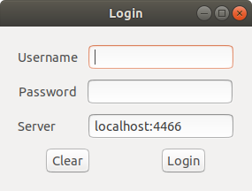
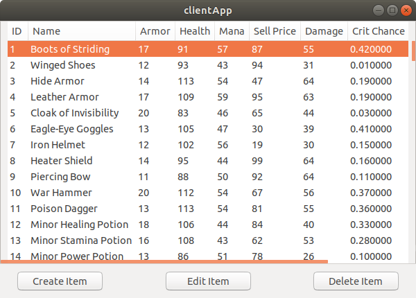
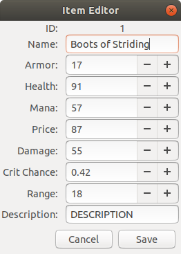
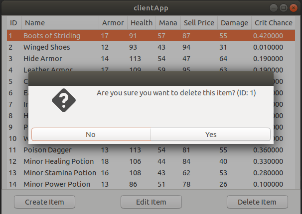

# CS469 Project

Distributed system for project CS469 \
Andrew Egeler \
Evan Snyder

We've chosen prompt 2 for our distributed systems assignment

## Installation
There are several tools included to get the application up and running. Follow along to install and configure the tool.

##### Required tools and Packages
* python3
* CMake
* libgtk-3-dev
* sqlite3
* libssl-dev

The first thing to do is to create a simple database to be used. A python script as been included to facilitate this process:
```
python3 create_db.py  
```
This will produce an `items.db` file that can be used for the item database tool.

At this point, we can build all of the tools using CMake:
```
cmake .
make
```
We still need to make a user account for login purposes. A tool has also been provided for this purpose:
```
./user_mgr username password
```
This will store the username and encrypted password into the database.

Finally, a server key and certificate must be available to encrypt the network traffic. This can be done via:
```
openssl req -newkey rsa:2048 -nodes -keyout key.pem -x509 -days 365 -out cert.pem
```

**At this point, all applications are ready to be run.**

### Configurations

The server application takes command line arguments as well as a config file to prepare the server. 
Command line arguments may appear as:
```
./server -l 4466 -s localhost -p 6644 -c server.conf -d items.db -i 1:H
```

A Sample config file may look like:
```
PORT=4466
BACKUP_SERVER=localhost
BACKUP_PORT=6644
BACKUP_PSK=qwertyghjkgl
DATABASE=items.db
INTERVAL=24:m
```

The backup server also takes command line arguments:
```
./backupserver -l 6644 -c backupserver.conf
```

As well as a config file:
```
PORT=6644
BACKUP_PSK=qwertyghjkgl
```

Finally, the client application can be run:
```
./clientApp
```

#### Usage
Once installation has been completed, the datastore backup server should be started first:
```
./datastore # RAN WITH DEFAULT ARGS
```

Then, we can run the server itself:
```
./server # ALSO USING DEFAULT ARGS
```

Lastly, the client can be launch:
```
./clientApp
```


These can all be on different machines or the same machine provided that the datastore and the main server are not
configured to listen on the same port.

Once the client is launched, you will be greeted with the login screen:



Enter the username and password used in the user manager tool to log into the application. If the credentials
are incorrect, or the specified server is unreachable, an appropriate error message will be displayed.

After logging in, the main window will appear, populated with the items in the database:



At this point, you can `Create`, `Edit`, or `Delete` items in the database. Creating or editing an item will bring up
the item editor dialog with the appropriate fields loaded:



After successfully creating or editing the item, data will be reloaded from the database to reflect the new changes

When deleting an item, a confirmation dialog will appear asking to validate the delete action:



Once operations are done, simply close the application to terminate the connection.

#### TODO:
* ~~Client Login UI~~
* ~~Client Main UI~~
* ~~Client Connect to server~~
* ~~Server argument parsing~~
* ~~Server SSL/TLS Listening~~
* ~~Server Multithreaded Client Accept~~
* ~~Server database operations thread~~
  * ~~Open Database~~
  * ~~Read from request queues~~
  * ~~Do Operation~~
  * ~~Send reponse back to requesting thread~~
  * ~~Periodic backup to datastore server~~
  * ~~DB Shutdown and closing~~
 * ~~Server Threadsafe queue~~
 * ~~Timer Thread~~
 * ~~Datastore SSL/TLS Listen~~
 * ~~Datastore SSL download and store file~~
 * ~~Datastore config file~~
